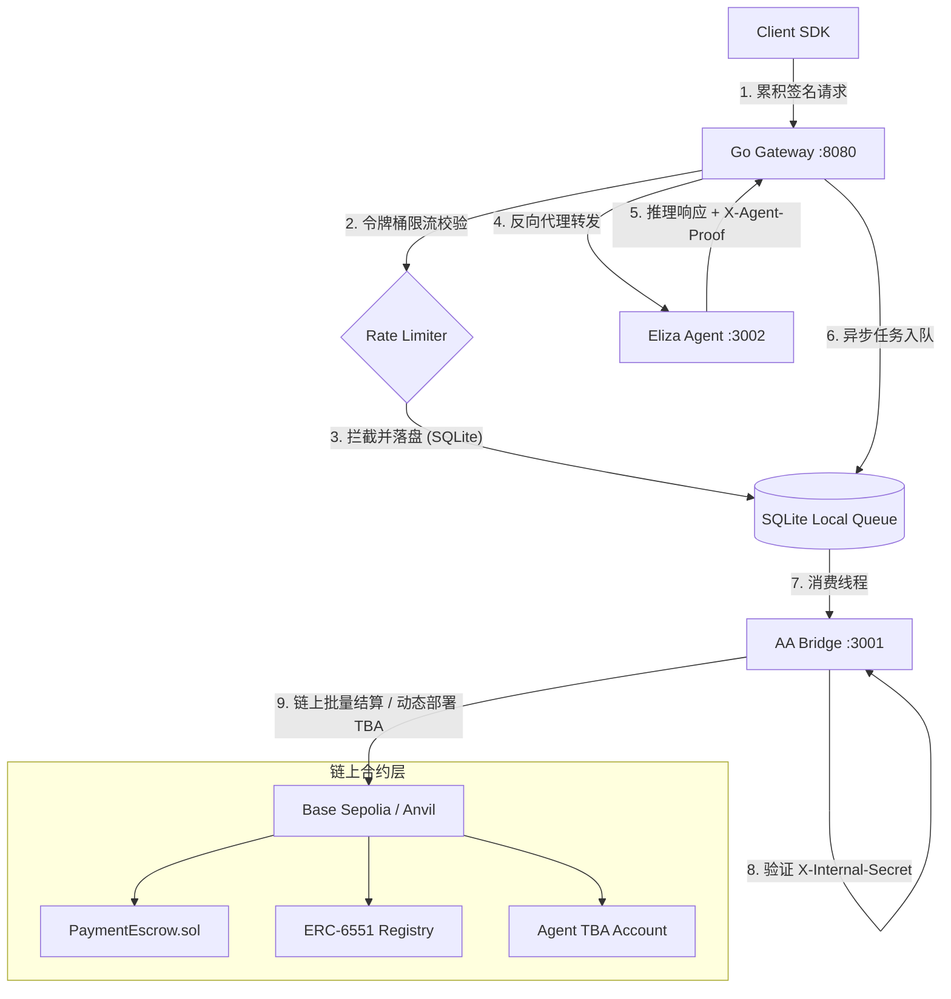

# AgentPay 智能体支付协议 — 架构优化与安全加固设计规格文档

> **项目定位**：对 AgentPay V1 基础架构的二期升级设计。引入本地任务持久化队列以消除异步结算丢失风险；引入累积签名状态通道以降低微额支付 Gas 损耗；引入 ERC-6551 TBA 架构整合身份与收款账户；在网关层实施令牌桶速率限制以防御恶意 DDoS 攻击。

---

## 1. 架构方案与拓扑图

二期优化后的系统拓扑结构如下：



---

## 2. 异步任务持久化队列 (Go Gateway)

为解决网关异步通知 AA Bridge 阶段宕机导致资金漏单结算失败的隐患，引入 SQLite 本地任务队列。

### 2.1 数据库模式设计

使用 `modernc.org/sqlite`（纯 Go 驱动）在本地创建 `gateway.db` 数据库文件：

```sql
CREATE TABLE IF NOT EXISTS settle_tasks (
    id INTEGER PRIMARY KEY AUTOINCREMENT,
    lock_id TEXT UNIQUE NOT NULL,
    proof TEXT NOT NULL,
    agent_owner TEXT NOT NULL,
    escrow_address TEXT NOT NULL,
    status TEXT NOT NULL,         -- 'pending', 'success', 'failed'
    retry_count INTEGER DEFAULT 0,
    next_retry_at DATETIME NOT NULL,
    created_at DATETIME DEFAULT CURRENT_TIMESTAMP
);
CREATE INDEX IF NOT EXISTS idx_pending_tasks ON settle_tasks (status, next_retry_at);
```

### 2.2 重试与退避机制

- **队列消费者**：网关在后台运行一个守护 Go 协程（Worker Loop），每 2 秒扫描一次 `status='pending' AND next_retry_at <= CURRENT_TIMESTAMP` 的数据。
- **重试限制**：单任务最多重试 5 次。退避延迟公式为：`next_retry_at = now + (2^retry_count) * 1s`。
- **状态流转**：
  - 调用 AA Bridge `/aa/settle` 成功：更新 `status='success'`。
  - 调用失败：累加 `retry_count`，更新 `next_retry_at`。重试满 5 次仍失败则标记为 `failed`，并触发邮件/系统日志级别 Critical 告警。

---

## 3. 状态通道（State Channel）与累计签名批量结算

为解决微支付交易 Gas 成本吞噬收益的痛点，使用单边累积签名通道。

### 3.1 链上合约变动 (`PaymentEscrow.sol`)

引入通道锁仓状态，废除一期单次锁单设计，重构为累积清算：

```solidity
enum PaymentStatus { Locked, Released, Refunded, Settled }

struct ChannelLock {
    address payer;
    uint256 agentId;
    uint256 maxAmount;       // 锁仓最大限制金额 (如 10 USDC)
    uint256 settledAmount;   // 已结算退仓划拨的金额
    uint256 expiresAt;       // 通道锁定到期时间
    PaymentStatus status;    // 合约锁定状态
}

// EIP-712 结构化签名散列
bytes32 public constant CHANNEL_SETTLE_TYPEHASH = keccak256(
    "ChannelSettle(bytes32 channelId,uint256 accumulatedAmount)"
);
```

**合约函数设计**：
- `lockChannel(uint256 agentId, uint256 amount, uint256 duration) external returns (bytes32 channelId)`：
  Payer 锁入 USDC（例如 10 USDC），资产划入 Escrow 托管，返回唯一的 `channelId`。
- `batchSettle(bytes32 channelId, uint256 accumulatedAmount, bytes calldata signature, address agentOwner) external onlySettler`：
  验证 `accumulatedAmount <= lock.maxAmount`。
  调用 `_verifyAgentTBA(lock.agentId, agentOwner)` 强制校验 `agentOwner` 必须是该智能体绑定的 ERC-6551 TBA 地址，防范越权划拨。
  利用 EIP-712 散列公式结合 `signature` 恢复出签名地址：
  ```solidity
  bytes32 digest = _hashTypedDataV4(keccak256(abi.encode(
      CHANNEL_SETTLE_TYPEHASH,
      channelId,
      accumulatedAmount
  )));
  address signer = ECDSA.recover(digest, signature);
  require(signer == lock.payer, "Invalid cumulative signature");
  ```
  校验通过后，将 `accumulatedAmount` 转账给接收方 `agentOwner`，剩余代币 `lock.maxAmount - accumulatedAmount` 原路退回给 `lock.payer`，通道置为 `Settled` 状态并关闭。

### 3.2 客户端 SDK 累进签名逻辑

- SDK 内部维护本地状态：`accumulatedSpend`（大数 bigint），每次成功执行推理，该值增加单次微支付金额。
- 构造 EIP-712 typed data 并使用 payer 私钥对 `[channelId, accumulatedSpend]` 签名。
- 发送 HTTP 请求时，附加头：`Authorization: Bearer <channelId>:<accumulatedSpend>:<signature>`。

---

## 4. ERC-6551 TBA 收款账户集成

将 Agent 身份与收款执行能力完美结合。

### 4.1 地址反查与结算防御

在 `PaymentEscrow.sol` 结算时，强制限制接收地址必须为对应的 ERC-6551 智能账户，避免结算方人为操纵接收人地址。

```solidity
import "../interfaces/IERC6551Registry.sol";

contract PaymentEscrow is Ownable {
    address public erc6551Registry;      // ERC-6551 注册表地址
    address public tbaImplementation;     // TBA 账户默认逻辑模板地址
    address public agentIdentityRegistry; // Agent 身份 NFT 合约地址

    function _verifyAgentTBA(uint256 agentId, address recipient) internal view {
        address computedTBA = IERC6551Registry(erc6551Registry).account(
            tbaImplementation,
            bytes32(0), // salt
            block.chainid,
            agentIdentityRegistry,
            agentId
        );
        require(recipient == computedTBA, "Recipient must be Agent TBA address");
    }
}
```

### 4.2 自动部署机制 (AA Bridge)

在 AA Bridge 调用 `batchSettle` 前，先查询 `computedTBA` 的 code.length。如果为 0，则先发送交易调用 `ERC6551Registry.createAccount(...)` 自动部署其 TBA 账户（由 ZeroDev Paymaster 进行 Gas 赞助），确保接收方账户存在且具备安全接收 ERC-20 能力。

---

## 5. 网关令牌桶限流与防 DDoS 设计 (Go Gateway)

网关使用本地令牌桶（Token Bucket）对连接数和请求进行物理硬拦截，抵御恶意高频空扫连接。

### 5.1 令牌桶中间件设计 (`gateway/internal/middleware/rate_limit.go`)

使用 `golang.org/x/time/rate` 模块，为每个请求 IP 地址维护一个令牌桶：

```go
type IPRateLimiter struct {
	ips   map[string]*rate.Limiter
	mu    sync.RWMutex
	r     rate.Limit
	b     int
}
```

- **参数配置**：限制每个 IP 客户端每秒最多允许发起 5 次请求（Rate = 5 r/s），桶最大容量为 10（Burst = 10）。
- **超限拦截**：若令牌不足，网关不再走后面的 X-402 及反代逻辑，直接在中间件拦截并快速返回 `HTTP 429 Too Many Requests`，Body JSON: `{"error": "rate_limit_exceeded", "message": "too many requests, please retry later"}`。此响应耗时 < 0.1ms，能最大程度保证 CPU 不被耗尽。

---

## 6. 测试与验证策略

- **合约单元测试**：针对 `PaymentEscrow.sol` 扩展的 `lockChannel`，`batchSettle`（EIP-712 验签成功划扣、超额划扣拦截、非法签名拦截）以及 TBA 合约交互进行 Foundry 测试覆盖。
- **网关队列单元测试**：使用 Mock 模拟 Bridge 掉线，验证 Go 队列能够正确记录至 sqlite，并在 3 次失败后指数级退避重试，恢复 Bridge 联通后完成自动结算状态更新。
- **SDK 累加测试**：测试 TS 客户端能够对累进数值正确生成 viem EIP-712 结构化签名。
- **限流测试**：用并发协程发起 20 次空头请求，断言网关前 10 次正常进入 X-402（返回 402），第 11 次起被直接返回 429 拦截。
