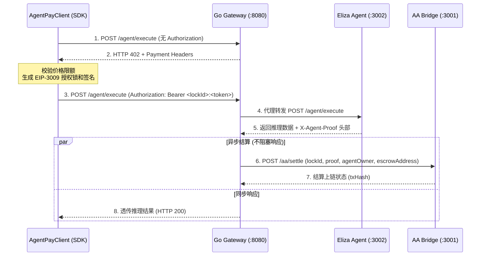

# Design Spec: Web3 SDK and System Integration (Task 6)

## 1. 架构概述

本模块旨在实现 AgentPay 系统的客户端 SDK，并搭建用于端到端验证的测试与一键启动环境。

系统的整体交互链路如下：


---

## 2. 组件详细设计

### 2.1 客户端 SDK (`sdk/src/client.ts`)

`AgentPayClient` 封装了第一次尝试、402 拦截、自签名授权，以及自动重试的逻辑。

```typescript
export interface AgentPayClientConfig {
  gatewayUrl?: string;
  maxPriceLimit?: bigint;
  privateKey?: `0x${string}`;
  env?: 'development' | 'production';
}

export class AgentPayClient {
  private gatewayUrl: string;
  private maxPriceLimit: bigint;
  private privateKey?: `0x${string}`;
  private env: 'development' | 'production';

  constructor(config: AgentPayClientConfig = {}) {
    this.gatewayUrl = config.gatewayUrl || 'http://127.0.0.1:8080';
    this.maxPriceLimit = config.maxPriceLimit || 5000n; // 默认最大限制 5000
    this.privateKey = config.privateKey;
    this.env = config.env || 'production';
  }

  public async execute(agentId: number, input: string): Promise<any> {
    // 1. 发起第一次请求
    let response = await this.sendRequest(agentId, input);

    // 2. 挑战捕获与自愈
    if (response.status === 402) {
      const priceStr = response.headers.get('X-402-Price');
      const paymentAddress = response.headers.get('X-402-Payment-Address');
      
      if (!priceStr || !paymentAddress) {
        throw new Error('Invalid HTTP 402 response from Gateway: missing headers');
      }

      const price = BigInt(priceStr);
      if (price > this.maxPriceLimit) {
        throw new Error(`Price limit exceeded: Price is ${price}, max limit is ${this.maxPriceLimit}`);
      }

      // 生成授权锁与 Token
      let authorizationHeader = '';
      if (this.env === 'development') {
        // Mock 环境下生成 Mock 格式 Token
        const lockId = 'lock-999';
        const token = 'mock-token-signed';
        authorizationHeader = `Bearer ${lockId}:${token}`;
      } else {
        // 生产环境下利用 EIP-3009 与私钥生成签名 (此处作为预留扩展)
        throw new Error('Production EIP-3009 signing is not fully integrated in mock environments');
      }

      // 3. 二次请求
      response = await this.sendRequest(agentId, input, authorizationHeader);
    }

    if (response.status !== 200) {
      const errorText = await response.text();
      throw new Error(`Request failed with status ${response.status}: ${errorText}`);
    }

    return response.json();
  }

  private async sendRequest(agentId: number, input: string, authHeader?: string): Promise<Response> {
    const headers: Record<string, string> = {
      'Content-Type': 'application/json',
    };
    if (authHeader) {
      headers['Authorization'] = authHeader;
    }

    return fetch(`${this.gatewayUrl}/agent/execute`, {
      method: 'POST',
      headers,
      body: JSON.stringify({ agentId, input }),
    });
  }
}
```

### 2.2 测试方案设计 (`sdk/test/e2e.test.ts`)

为了在独立测试环境下完成全链路验证（不依赖外部 Go 编译及 Anvil 节点），我们在集成测试中自建 Mock HTTP 服务：

1. **Gateway Mock (Port 8080)**
   - 拦截 POST `/agent/execute`。
   - 若无 `Authorization` 头，则返回 `HTTP 402` 并带上 `X-402-*` 头部。
   - 若有 `Authorization: Bearer lock-999:mock-token-signed`，解析出 `lockId = lock-999`。然后代理转发请求给 Downstream Agent。
   - 收到 Downstream Agent 的响应后，如果响应包含 `X-Agent-Proof`，则**异步触发**调用 AA Bridge (Port 3001) 的 `/aa/settle` 路由，并把结果透传给客户端。

2. **Downstream Agent Mock (Port 3002)**
   - 拦截 POST `/agent/execute`。
   - 验证 `input` 和 `agentId` 是否有效。
   - 返回 `HTTP 200`，Body `{ output: "Processed by AgentPay AI: E2E Integration Test String" }`，并在 Response Header 中加入 `X-Agent-Proof: mock-proof-base64` / `{ output, proof }`。

3. **AA Bridge Mock (Port 3001)**
   - 拦截 POST `/aa/settle`。
   - 验证传入的 `lockId` 和 `proof`。
   - 记录请求记录，返回 `{ success: true, txHash: "0x7777777777777777777777777777777777777777777777777777777777777777" }`。

---

## 3. Docker-Compose 部署编排

在根目录下创建 `docker-compose.yml`，在各微服务中添加 `Dockerfile`：

### 3.1 Dockerfile 规划
* **Gateway Dockerfile (`gateway/Dockerfile`)**: Go 多阶段构建。
* **AA Bridge Dockerfile (`aa-bridge/Dockerfile`)**: 基于 Node 18 + TS。
* **Agent Dockerfile (`agent/Dockerfile`)**: 基于 Node 18 + TS。

### 3.2 Docker-Compose 服务列表
1. `anvil`: 本地以太坊测试链。
2. `aa-bridge`: `RPC_URL=http://anvil:8545`, `DEV_MODE=true`。
3. `agent`: 推理执行。
4. `gateway`: 连接 `agent` 和 `aa-bridge`。
