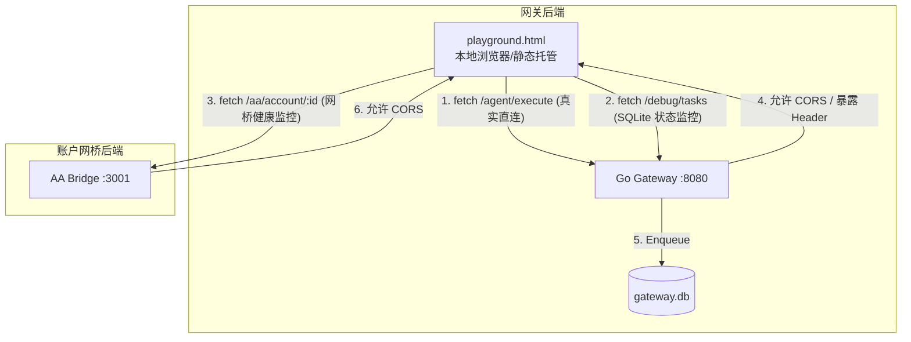

# AgentPay 智能沙盒与调试 Web 面板 — 设计规格文档

> **项目定位**：为 AgentPay 协议提供一键式的 Web 交互调试沙盒。支持纯前端 Mock 演示（无需运行环境）与本地直连调试双轨模式；在 Go 网关与 TS 桥接层引入 CORS 跨域放行；支持实时追踪自愈协议时序逻辑；实现本地 SQLite 任务队列可视化监视。

---

## 1. 系统架构与数据流拓扑

Web 调试沙盒与本地运行环境的连通关系如下：



---

## 2. 视觉规范与 UI 布局设计

Web 调试面板保存为单页 `playground.html`，主打深色毛玻璃 (Neon Dark + Glassmorphism) 视觉美学。

### 2.1 CSS 样式与渐变规范
- **背景光效**：使用径向渐变模拟极光散射。
- **毛玻璃卡片 (Card)**：
  ```css
  .glass-card {
      background: rgba(15, 23, 42, 0.45);
      backdrop-filter: blur(16px) saturate(180%);
      -webkit-backdrop-filter: blur(16px) saturate(180%);
      border: 1px solid rgba(255, 255, 255, 0.08);
      border-radius: 16px;
      box-shadow: 0 8px 32px 0 rgba(0, 0, 0, 0.37);
  }
  ```
- **渐变按钮与状态色**：
  - 主要交互色（Indigo/Violet）：`linear-gradient(135deg, #6366f1 0%, #a855f7 100%)`。
  - 健康状态（Success 翠绿）：`#10b981`。
  - 协议异常（402 橙黄）：`#f59e0b`。
  - 拦截状态（429 霓红）：`#ef4444`。

### 2.2 版面三大分区

- **分区 A：控制台 (Control Center)**：
  - **网络与模式切换**：开关切换 "Mock 演示模式"（前端闭环，免启动）与 "真实直连调试"。
  - **请求参数输入**：Agent ID、输入文本 (Input)、单次支付限额 (Max Price)。
  - **操作按钮**：`发送请求 (Execute)` 与 `并发重试测试 (Promise.all)`。
- **分区 B：网络状态与通道账本监视器 (Ledger & Health Monitor)**：
  - **节点状态红绿灯**：定时 ping 网关 (:8080) 与网桥 (:3001) 状态。
  - **SQLite 队列列表 (SQL Task Table)**：表格形式展示任务 ID、Lock ID、状态 (Pending/Success/Failed) 和重试次数。
  - **本地通道列表**：表格形式展示 `channelId`、已结余额 (Confirmed Spend) 和累计发生额。
- **分区 C：协议自愈时序图与终端日志 (Timeline & Terminal Console)**：
  - **垂直时序图**：按 1、2、3、4 步动态高亮协议各阶段。
  - **终端日志流**：模拟黑底高对比度命令行输出。

---

## 3. 后端跨域 (CORS) 改造设计

### 3.1 Go Gateway 跨域配置 (`gateway/cmd/gateway/main.go`)

为了允许前端 JS 读取 `X-402-Price` 等协议首部，网关必须执行跨域头放行及暴露：

```go
func CORSMiddleware(next http.Handler) http.Handler {
    return http.HandlerFunc(func(w http.ResponseWriter, r *http.Request) {
        w.Header().Set("Access-Control-Allow-Origin", "*")
        w.Header().Set("Access-Control-Allow-Methods", "POST, GET, OPTIONS, PUT, DELETE")
        w.Header().Set("Access-Control-Allow-Headers", "Content-Type, Authorization, X-Internal-Secret")
        // 关键：允许 JS 读取 X-402 自定义协议头
        w.Header().Set("Access-Control-Expose-Headers", "X-402-Payment-Address, X-402-Price, X-402-Payment-Type, X-Agent-Proof")
        
        if r.Method == "OPTIONS" {
            w.WriteHeader(http.StatusOK)
            return
        }
        next.ServeHTTP(w, r)
    })
}
```

### 3.2 AA Bridge 跨域配置 (`aa-bridge/src/index.ts`)

在 Fastify 实例上载入跨域插件：

```typescript
import cors from '@fastify/cors';

await server.register(cors, {
  origin: '*',
  methods: ['GET', 'POST', 'OPTIONS'],
  allowedHeaders: ['Content-Type', 'Authorization', 'x-internal-secret'],
});
```

---

## 4. SQLite 监视接口设计 (Go Gateway)

### 4.1 任务列表查询 API (`gateway/internal/queue/sqlite_queue.go`)

在 `QueueManager` 内部增加查询接口，用于向调试前端输出最新的 10 条后台结算状态：

```go
func (q *QueueManager) GetLatestTasks(limit int) ([]map[string]interface{}, error) {
    q.mu.Lock()
    defer q.mu.Unlock()
    rows, err := q.db.Query(`SELECT lock_id, proof, agent_owner, escrow_address, status, retry_count, created_at 
        FROM settle_tasks ORDER BY id DESC LIMIT ?`, limit)
    if err != nil {
        return nil, err
    }
    defer rows.Close()

    var tasks []map[string]interface{}
    for rows.Next() {
        var lockID, proof, owner, escrow, status string
        var retryCount int
        var createdAt int64 // 统一使用 int64 Unix 时间戳进行 SQLite 读取
        rows.Scan(&lockID, &proof, &owner, &escrow, &status, &retryCount, &createdAt)
        
        tasks = append(tasks, map[string]interface{}{
            "lock_id":        lockID,
            "proof":          proof,
            "agent_owner":    owner,
            "escrow_address": escrow,
            "status":         status,
            "retry_count":    retryCount,
            "created_at":     createdAt,
        })
    }
    return tasks, nil
}
```

### 4.2 路由挂载 (`gateway/cmd/gateway/main.go`)

```go
r.Get("/debug/tasks", func(w http.ResponseWriter, r *http.Request) {
    w.Header().Set("Content-Type", "application/json")
    tasks, err := queueMgr.GetLatestTasks(10)
    if err != nil {
        w.WriteHeader(http.StatusInternalServerError)
        w.Write([]byte(`{"error":"` + err.Error() + `"}`))
        return
    }
    json.NewEncoder(w).Encode(tasks)
})
```

---

## 5. 调试客户端 Mock 自愈动效逻辑

在 [playground.html](file:///Users/oraclez/code/AgentPay/playground.html) 中编写纯前端仿真器逻辑：

- **第一阶段（发出请求）**：
  - 点击“Execute”，控制台打印 `[INFO] Initializing execute request without token...`，Timeline 第一阶段“1. Initial Request”开始闪烁呼吸灯。
- **第二阶段（捕获挑战）**：
  - 延时 800ms 后，捕获 402。控制台打印 `[WARN] Received HTTP 402 Challenge from Gateway: X-402-Price: 1000`。第一阶段转为常亮，第二阶段“2. X-402 Challenge Recv”闪烁。
- **第三阶段（本地签名）**：
  - 延时 600ms，展示锁仓和状态通道余额递增（1000 -> 2000）。控制台打印 `[INFO] Channel balance incremented. Generating EIP-712 typed signature...`。第三阶段“3. Local Signature”高亮并显示模拟的 Signature hash。
- **第四阶段（二次重试成功）**：
  - 延时 1000ms，二次请求成功放行。控制台打印 `[SUCCESS] Received HTTP 200 OK: Processed by AgentPay AI.`。第四阶段“4. Settle Enqueued”常亮绿色霓虹灯。

---

## 6. 测试与验证策略

- **CORS 跨域测试**：利用 `curl -I -X OPTIONS http://127.0.0.1:8080/agent/execute` 断言返回的 CORS Headers 完整无缺，且包含 `Access-Control-Expose-Headers`。
- **Debug 接口测试**：调用 `curl http://127.0.0.1:8080/debug/tasks`，断言能够返回 JSON 数组且格式匹配，没有导致网关崩溃。
- **前端动效验证**：在本地浏览器双击打开 `playground.html`，执行 Mock 并发流程，断言日志终端输出平稳，Timeline 顺序高亮无误。
