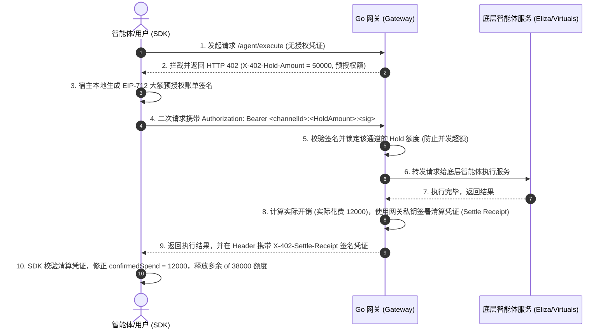

# AgentPay 智能体高并发免 Gas 费微支付网关设计规格说明书 (Spec)

本设计文档旨在为 AgentPay 项目新增 **智能体免 Gas 费高频微支付网关（对接 Virtuals/Eliza 生态）**。采用“客户端宿主本地签名 (Host-Local Signing)”与“全链下信贷锁定与乐观惩罚机制 (Optimistic Penalized Hold)”的技术架构，实现零 Gas 费、高并发、具备防赖账及防 DDoS 安全的 AI-to-AI 商业结算网络。

---

## 1. 核心技术架构 (System Architecture)

系统由三个主要部分协同运作：
1. **TypeScript 客户端 SDK (`sdk/`)**：集成在 AI 智能体宿主环境中，管理 TBA 钱包私钥，进行本地 EIP-712 预授权账单签名，并自动根据网关返回的清算凭证修正通道实际余额。
2. **Chi Go 网关 (`gateway/`)**：拦截智能体请求，触发 HTTP 402 预授权挑战，并在下游智能体执行成功后，通过网关私钥签名生成清算凭证 (Settle Receipt)。
3. **链上智能合约 (`contracts/`)**：`PaymentEscrow.sol` 状态通道合约，为网关防范智能体赖账提供乐观惩罚清算的链上保障。



---

## 2. 数据结构与协议标准 (Data Protocols)

### 2.1 EIP-712 状态通道预授权消息 (Authorization Hold Message)

客户端在收到 402 后签署的信贷锁定数据结构：

```typescript
const domain = {
  name: 'AgentPay',
  version: '1',
  chainId: 11155111, // 例如 Base Sepolia
  verifyingContract: '0x...', // PaymentEscrow.sol 地址
};

const types = {
  ChannelHold: [
    { name: 'channelId', type: 'bytes32' },
    { name: 'holdAmount', type: 'uint256' }, // 冻结的微额度 (以微美分为单位)
    { name: 'nonce', type: 'uint256' },      // 防重放随机数
    { name: 'expiration', type: 'uint256' }, // 预授权有效期 (Unix Timestamp)
  ]
};
```

格式化请求标头：
`Authorization: Bearer <channelId>:<holdAmount>:<nonce>:<expiration>:<signature_hex>`

### 2.2 网关清算凭证 (Settle Receipt)

网关发回给客户端，证明实际只扣除了一部分资金的安全凭证：

```go
type SettleReceipt struct {
	ChannelID  string `json:"channelId"`
	HoldAmount int64  `json:"holdAmount"`
	ActualCost int64  `json:"actualCost"` // 实际扣除金额
	Nonce      int64  `json:"nonce"`
	Signature  string `json:"signature"`  // 网关私钥签署的 EIP-712/ECDSA 签名
}
```

响应头格式：
`X-402-Settle-Receipt: <channelId>:<holdAmount>:<actualCost>:<nonce>:<receipt_sig>`

---

## 3. 组件详细修改说明

### 3.1 TS 客户端 SDK (`sdk/src/client.ts`)
*   **改动点**：
    1. 完善 `executeInternal` 逻辑，在面临 `paymentType === 'channel'` 时，通过本地配置的 `privateKey` 和 `viem` (`signTypedData`) 动态生成真实的 EIP-712 预授权签名。
    2. 捕获 HTTP 响应头中的 `X-402-Settle-Receipt`。
    3. 校验网关清算凭证签名是否由合法的网关公钥签署。若合法，将本地通道的 `confirmedSpend` 回落并修正为：`lastConfirmedSpend + actualCost`。
    4. 若遭遇非 402/200 错误，释放当前通道的并发锁定，确保通道自愈能力。

### 3.2 Go 网关中间件 (`gateway/internal/middleware/x402.go`)
*   **改动点**：
    1. 当缺少 Authorization 头时，拦截并返回 `HTTP 402`。新增返回头：
       - `X-402-Payment-Type: channel`
       - `X-402-Hold-Amount: 50000` (单次预授权额度配置)
    2. 当携带 `Authorization: Bearer <channelId>:<holdAmount>:<nonce>:<expiration>:<sig>` 时，解析并验证智能体签名对预授权额度的链下授权是否合法。若合法，将解析出的参数写入 Context。

### 3.3 Go 反向代理 (`gateway/internal/proxy/proxy.go`)
*   **改动点**：
    1. 在接收到智能体服务响应并准备向客户端返回时，根据下游实际开销情况计算 `actualCost`。
    2. 使用网关本地配置的私钥对 `SettleReceipt` 进行签名，将签名写入 `X-402-Settle-Receipt` 头发送给客户端。
    3. 若智能体实际消费的 `actualCost` 未超标，则在 SQLite 中保存该状态，防范后续乐观惩罚纠纷。

---

## 4. 验证计划 (Verification Plan)

### 4.1 自动化单元测试
*   编写 `gateway/internal/middleware/x402_hold_test.go`，测试在带有/不带有 Hold Authorization 头的情况下的 HTTP 响应。
*   编写 `sdk/test/client_hold.test.ts`，Mock 网关返回 402 及清算凭证，测试 `AgentPayClient` 的本地 EIP-712 签名生成与清算凭证自愈修正。

### 4.2 沙盒手动验证
*   利用 [playground.html](file:///Users/oraclez/code/AgentPay/playground.html) 扩展预授权体验面板：
    1. 显示智能体当前的预授权余额。
    2. 发起请求时展示“预授权锁定中 (Hold Amount: 0.05 USDC)”。
    3. 请求成功返回后，动态展示“已清算 actualCost = 0.003 USDC，解冻 0.047 USDC”。
